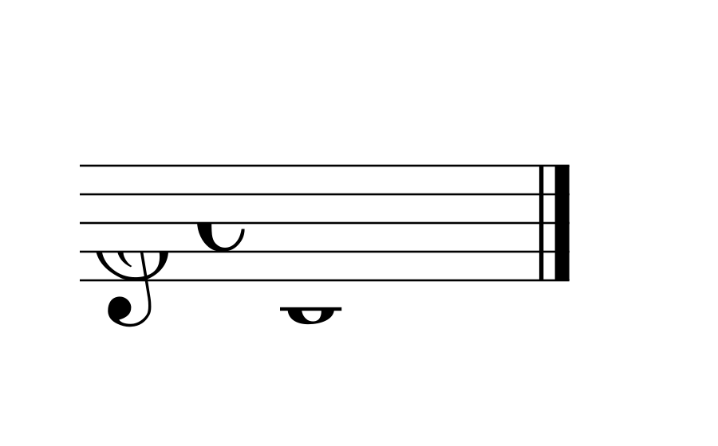
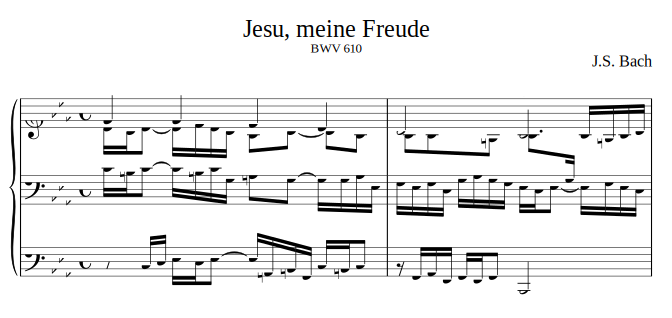

# Lilylet

Lilylet is a LilyPond-like music notation language designed for Markdown rendering and symbolic music representation in AIGC applications.

## Hello World

```lyl
\key c \major \time 4/4 \clef "treble" c1 \bar "|."
```



## A Comprehensive Example

```lyl
[title "Jesu, meine Freude"]
[subtitle "BWV 610"]
[composer "J.S. Bach"]

\staff "1" \key c \minor \time 4/4 \clef "treble" \stemUp g'4 g f ef \\
\staff "1" \stemDown ef16[ d ef8]~ ef16[ f ef d] c8[ d]~ d[ c] \\
\staff "2" \clef "bass" c16[ b c8]~ c16[ b c g] a8[ g]~ g16[ g af ef] \\
\staff "3" \clef "bass" r8 c,16[ d] ef[ d ef8]~ ef16[ a, b g] c[ b c8] | % 1

\staff "1" \stemUp d2 c\fermata \\
\staff "1" \stemDown c8[ c4 b8] c8.[ \staff "2" \stemUp g16] \staff "1" c[ b c d] \\
\staff "2" f,16[ ef f d] g[ af g f] ef[ d ef8]~ ef16[ f ef d] \\
\staff "3" r16 g,[ af f] g[ f g8] c,2 | % 2
```



## Try It Online

- [Live Editor](https://k-l-lambda.github.io/lilylet-live-editor/) - Interactive editor with real-time music notation rendering
- [Markdown Editor](https://k-l-lambda.github.io/lilylet-live-editor/markdown) - Write documents with embedded Lilylet music snippets
- [Tutorial](https://k-l-lambda.github.io/lilylet-live-editor/docs/lilylet-tutorial.html) - Comprehensive guide to Lilylet syntax

## Why a New Language?

### 1. Leveraging LilyPond's Excellent Syntax

LilyPond uses a LaTeX-like text markup syntax with significant advantages:

- **Beginner-friendly**: Intuitive commands like `\clef`, `\key`, `\time` require no knowledge of complex binary formats
- **Human-readable**: Notes are represented directly as letters (c d e f g a b), durations as numbers (4 = quarter note)
- **Relative pitch mode**: Each note is calculated relative to the previous one—only octave shifts (`'` or `,`) are needed when the interval exceeds a fourth, dramatically reducing octave markers. See [LilyPond Relative Octave Entry](https://lilypond.org/doc/v2.23/Documentation/notation/writing-pitches#relative-octave-entry)

### 2. Reducing LilyPond's Excessive Flexibility

LilyPond is powerful but overly flexible—the same music can be written in multiple ways, which creates problems for AIGC scenarios:

| Issue | LilyPond | Lilylet |
|-------|----------|---------|
| Verbose context | Requires `\version`, `\header`, `\paper`, `\layout` boilerplate | Only core music content |
| Inconsistent formats | Relative pitch, absolute pitch, multiple chord notations | Unified format, reduced ambiguity |
| Complex nesting | `\new Staff << \new Voice \relative c' { ... } >>` | `\staff "1" ...` |

### 3. Optimized for AIGC

- **Shorter context description**: Removes redundant information, allowing LLMs to process more music content within limited context windows
- **Formatted layout**: Fixed syntax structure facilitates model learning and generation
- **Markdown-embeddable**: Music snippets can be directly embedded in documents
